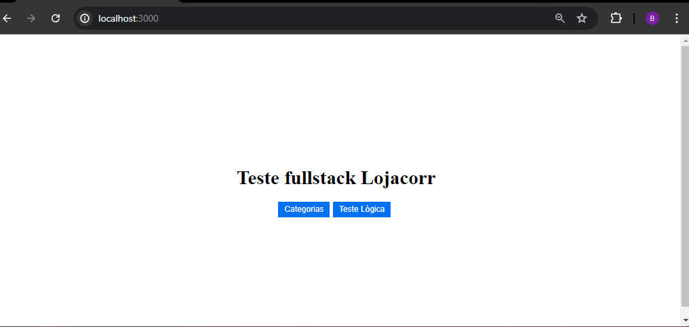
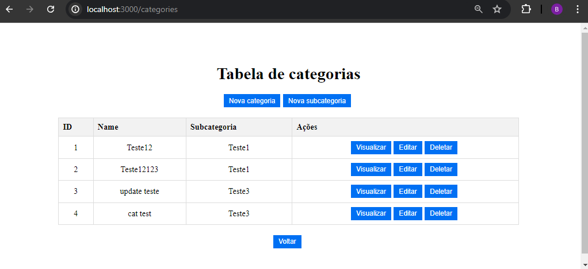
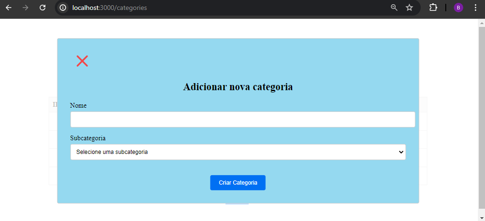
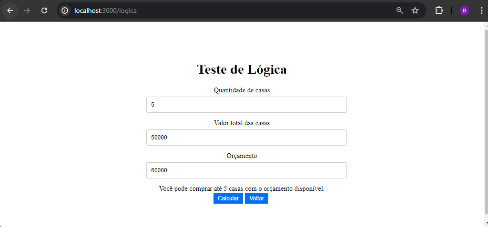

# Teste Lojacorr - FullStack

Projeto desnvolvid com o foco de consumir as apis desenvolvidas na etapa de backend do teste, por isso a estilizaão está de forma simplificada.

repositório para o backend desenvolvido em Laravel e Docker.
 
[Back-end](https://github.com/bruno-lima1504/api-laravel-docker)

## Home

## Categories

## Modal

## Teste Lógica
